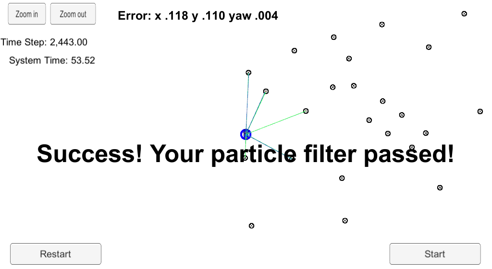

## Project Introduction
Your robot has been kidnapped and transported to a new location! Luckily it has a map of this location, a (noisy) GPS estimate of its initial location, and lots of (noisy) sensor and control data.

In this project I implemented a 2 dimensional particle filter in C++. The particle filter will be given a map and some initial localization information (analogous to what a GPS would provide). At each time step the filter will also get observation and control data in order to be able to localize itself.




## Running the Code
This project involves the Term 2 Simulator which can be downloaded [here](https://github.com/udacity/self-driving-car-sim/releases)

This repository includes two files that can be used to set up and intall uWebSocketIO for either Linux or Mac systems. For windows you can use either Docker, VMware, or even Windows 10 Bash on Ubuntu to install uWebSocketIO.

Once the install for uWebSocketIO is complete, the main program can be built and ran by doing the following from the project top directory.

1. mkdir build
2. cd build
3. cmake ..
4. make
5. ./particle_filter

Alternatively some scripts have been included to streamline this process, these can be leveraged by executing the following in the top directory of the project:

1. ./clean.sh
2. ./build.sh
3. ./run.sh

Tips for setting up your environment can be found [here](https://classroom.udacity.com/nanodegrees/nd013/parts/40f38239-66b6-46ec-ae68-03afd8a601c8/modules/0949fca6-b379-42af-a919-ee50aa304e6a/lessons/f758c44c-5e40-4e01-93b5-1a82aa4e044f/concepts/23d376c7-0195-4276-bdf0-e02f1f3c665d)


Your job is to build out the methods in `particle_filter.cpp` until the simulator output says:

```
Success! Your particle filter passed!
```

# Implementing the Particle Filter
The only file you should modify is `particle_filter.cpp` in the `src` directory. The file contains the scaffolding of a `ParticleFilter` class and some associated methods. Read through the code, the comments, and the header file `particle_filter.h` to get a sense for what this code is expected to do.

If you are interested, take a look at `src/main.cpp` as well. This file contains the code that will actually be running your particle filter and calling the associated methods.

## Inputs to the Particle Filter
You can find the inputs to the particle filter in the `data` directory. 

#### The Map*
`map_data.txt` includes the position of landmarks (in meters) on an arbitrary Cartesian coordinate system. Each row has three columns
1. x position
2. y position
3. landmark id

### All other data the simulator provides, such as observations and controls.

> * Map data provided by 3D Mapping Solutions GmbH.

## Success Criteria
If your particle filter passes the current grading code in the simulator (you can make sure you have the current version at any time by doing a `git pull`), then you should pass! 

The things the grading code is looking for are:


1. **Accuracy**: your particle filter should localize vehicle position and yaw to within the values specified in the parameters `max_translation_error` and `max_yaw_error` in `src/main.cpp`.

2. **Performance**: your particle filter should complete execution within the time of 100 seconds.


